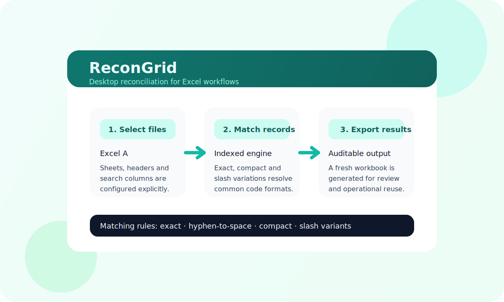
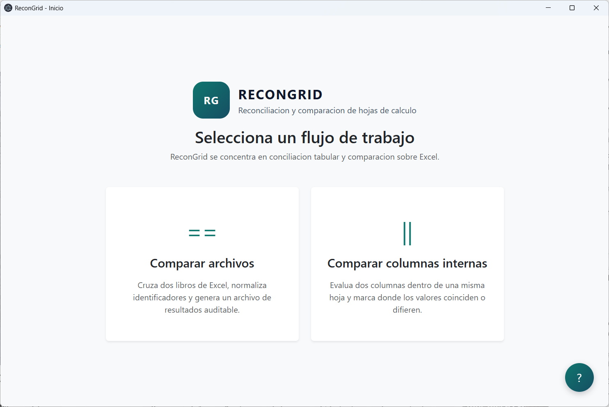
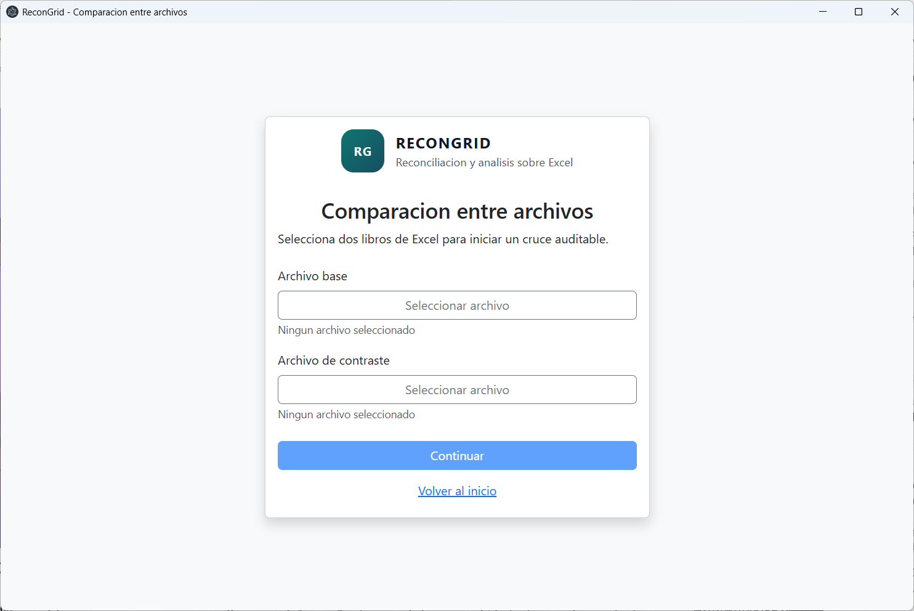
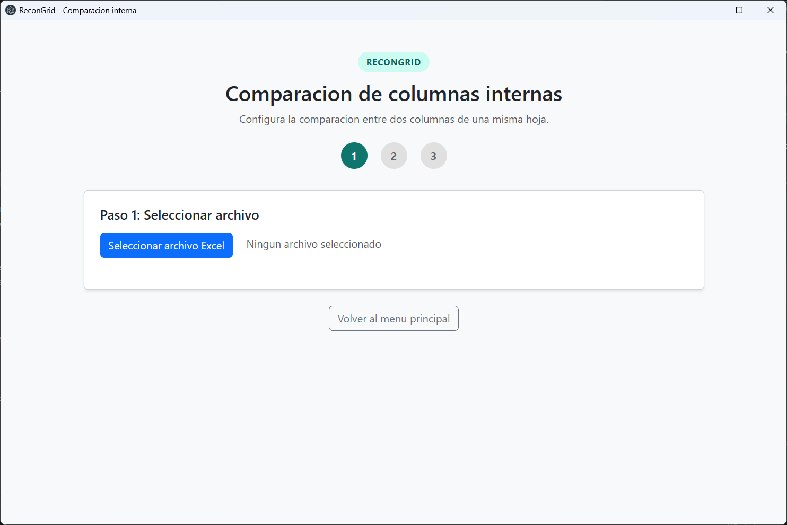

# ReconGrid

ReconGrid is an Electron desktop application for spreadsheet reconciliation, workbook comparison, and auditable Excel exports.



## Repository status

This repository is publicly visible for portfolio, technical evaluation, and recruitment review.

The source code is proprietary and **not open source**. No permission is granted to use, copy, modify, redistribute, sublicense, train on, republish, commercialize, or create derivative works from this software, in whole or in part, without prior explicit written permission from the author. See [LICENSE](LICENSE).

## What ReconGrid solves

Many business teams reconcile spreadsheet data manually: comparing workbooks, normalizing identifiers, checking whether values match, and preparing an auditable result file for review.

ReconGrid turns that manual workflow into a repeatable desktop process focused on Excel files.

## Screenshots

| Home | File comparison | Internal column comparison |
|---|---|---|
|  |  |  |

## Visible workflows

- Compare two Excel workbooks.
- Compare two columns within the same worksheet.
- Export results into an auditable Excel artifact.

## Core capabilities

- Explicit worksheet, header-row, and column configuration.
- Flexible identifier matching backed by in-memory indexes.
- Matching strategies for exact, compact, slash-variant, and normalized identifiers.
- Internal comparison output with a verdict column.
- Excel export as the final operational artifact.
- Clear progress and error feedback during long-running jobs.

## Architecture

ReconGrid uses a layered structure to separate UI concerns from domain behavior and Excel infrastructure:

- `presentation/`: HTML views, renderer scripts, and UI controllers.
- `domain/`: entities and use cases.
- `data/`: repositories plus Excel read/write services.
- `infrastructure/`: auxiliary configuration and inherited support modules.
- `tests/`: executable checks for matching and comparison behavior.
- `benchmarks/`: scripts used to evaluate matching performance.

The main design goal is to keep spreadsheet parsing, matching rules, and UI flows separated enough to evolve independently.

## Tech stack

- Electron
- JavaScript / CommonJS
- Bootstrap
- ExcelJS
- electron-builder
- Node.js test scripts

## Commands

```bash
npm install
npm run dev
npm test
npm run bench:matching
npm run dist:win
npm run dist:linux
npm run dist:mac
```

## Benchmarks and operational metrics

`npm run bench:matching` executes a reproducible synthetic benchmark with 20,000 source rows and 20,000 target rows. It is intended to compare matching strategies and detect performance regressions in the public codebase.

During professional use with confidential business data, the broader automation workflow centralized approximately 400,000 historical records and processed more than 50,000 records in 22.87 seconds, with an observed matching rate of 90–95%. The source workbooks cannot be published because they contain third-party operational information.

These operational figures describe the private production workload; they are not presented as the output of the repository's synthetic benchmark.

## Local development

```bash
git clone https://github.com/JhomarSanchez/ReconGrid.git
cd ReconGrid
npm install
npm run dev
```

## Build targets

ReconGrid is configured with `electron-builder` for:

- Windows NSIS installer
- Windows portable executable
- Linux AppImage
- macOS package target

## Public project docs

- [Matching engine](docs/matching-engine.md)
- [Release checklist](docs/release-checklist.md)
- [Repository metadata recommendations](docs/repository-metadata.md)

## Recommended GitHub metadata

Use this repository description:

```text
Electron desktop app for spreadsheet reconciliation, workbook comparison and auditable Excel exports.
```

Recommended topics:

```text
electron, javascript, excel, spreadsheet, data-reconciliation, desktop-app, automation, layered-architecture, exceljs, benchmarking
```

## Portfolio note

ReconGrid demonstrates desktop automation, spreadsheet processing, layered architecture, benchmarking, and operational tooling. It complements backend and full-stack work by showing an approach to data-heavy business workflow automation.
